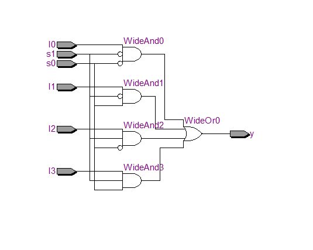
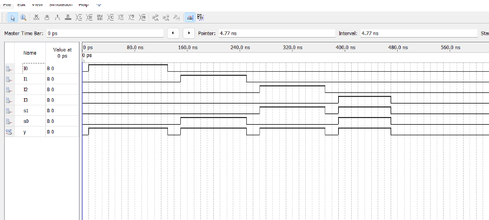

### Ex. No. 7
### Date: 2.6.23
# Implementation of Multiplexer and Demultiplexer using Verilog HDL
## Aim:
To design and implement 4 X1 multiplexer and 1X4 demultiplexer circuit using Verilog HDL and verify its truth table.
## Components Required:
1.	Laptop with Quartus software and modelsim software.
## Theory:
## Multiplexer
Multiplexer is a combinational circuit that has maximum of 2n data inputs, ‘n’ selection lines and single output line. One of these data inputs will be connected to the output based on the values of selection lines.
Since there are ‘n’ selection lines, there will be 2n possible combinations of zeros and ones. So, each combination will select only one data input. Multiplexer is also called as Mux.
4x1 Multiplexer has four data inputs I3, I2, I1 & I0, two selection lines s1 & s0 and one output Y. One of these 4 inputs will be connected to the output based on the combination of inputs present at these two selection lines.
### Truth Table
 

### Logic Diagram
 

### Logic Expression
Y=S1′S0′I0+S1′S0I1+S1S0′I2+S1S0I3

### Block diagram
 

## De-Multiplexer
De-Multiplexer is a combinational circuit that performs the reverse operation of Multiplexer. It has single input, ‘n’ selection lines and maximum of 2n outputs. The input will be connected to one of these outputs based on the values of selection lines.
Since there are ‘n’ selection lines, there will be 2n possible combinations of zeros and ones. So, each combination can select only one output. De-Multiplexer is also called as De-Mux.
1x4 De-Multiplexer has one input I, two selection lines, s1 & s0 and four outputs Y3, Y2, Y1 &Y0. The single input ‘I’ will be connected to one of the four outputs, Y3 to Y0 based on the values of selection lines s1 & s0.
### Truth Table
 

### Logic Expression
Y3=s1s0I  
Y2=s1s0′I  
Y1=s1′s0I  
Y0=s1′s0′I  

### Logic Diagram
 

### Block diagram
 

## Procedure:
1.	Type the program in Quartus software.
2.	Compile and run the program.
3.	Generate the RTL schematic and save the logic diagram.
4.	Create nodes for inputs and outputs to generate the timing diagram.
5.	For different input combinations, generate the timing diagram.

## Program:
### Multiplexer:
module mux(I0,I1,I2,I3,s1,s0,y); 
input I0,I1,I2,I3,s0,s1; 
output y; 
wire p,q,r,s,s1d,s0d; 
not(s1d,s1); 
not(s0d,s0); 
and(p,s1d,s0d,I0); 
and(q,s1d,s0,I1); 
and(r,s1,s0d,I2); 
and(s,s1,s0,I3); 
or(y,p,q,r,s); 
endmodule 
### De-Multiplexer:
module demux(I,s1,s0,y3,y2,y1,y0); 
input I,s1,s0; 
output y3,y2,y1,y0; 
wire s1d,s0d; 
not(s1d,s1); 
not(s0d,s0); 
and(y3,s1,s0,I); 
and(y2,s1,s0d,I); 
and(y1,s1d,s0,I); 
and(y0,s1d,s0d,I); 
endmodule 
## RTL Schematic:
### Multiplexer: 
 
### De-Multiplexer: 

## Timing Diagram:
### Multiplexer: 
 
### De-Multiplexer: 
 
## Result:
Thus the multiplexer and demultiplexer circuits are designed and implemented and the truth tables are verified.

